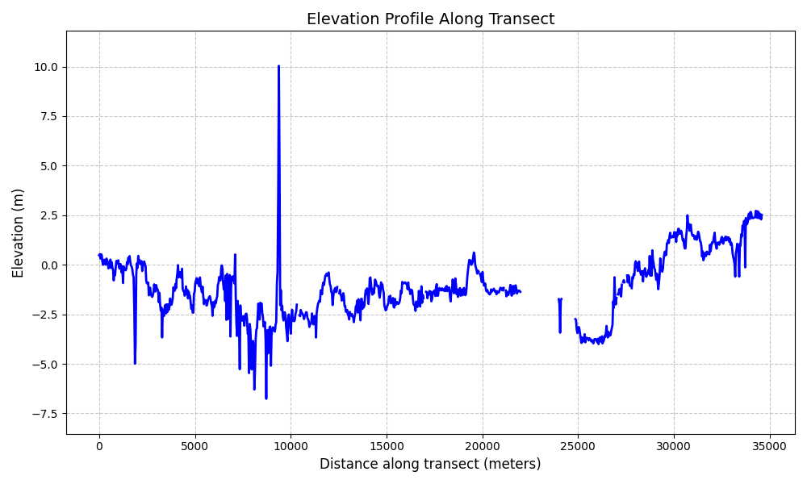

# Delta DTM Line Plot

A FastAPI-based web service that generates elevation profile plots along transect lines using the Deltares Digital Terrain Model (Delta DTM) dataset.

## Overview

This application provides an API endpoint that accepts a LineString geometry and returns an elevation profile plot along that line. It uses the Delta DTM dataset stored in Azure Blob Storage to extract elevation data.



## For Scientists

### How It Works

The core functionality is implemented in `src/transsect_plot.py` and follows these steps:

1. **Data Selection**: When given a LineString geometry, the application identifies which Delta DTM tiles intersect with the line.
2. **Data Retrieval**: The relevant raster tiles are fetched from Azure Blob Storage.
3. **Data Processing**: 
   - The raster tiles are merged into a single data array
   - Elevation values are sampled along the transect line
   - Distances along the transect are calculated in meters
4. **Visualization**: A matplotlib figure is generated showing the elevation profile.

### Key Functions

- `get_intersecting_item_ids()`: Identifies which Delta DTM tiles intersect with the input line
- `get_datasets()`: Asynchronously fetches the raster data for the intersecting tiles
- `merge_and_mask_datasets()`: Combines multiple raster datasets into a single dataset
- `transsect()`: Samples elevation values along the transect line
- `get_distances()`: Calculates distances along the transect in meters
- `create_profile_plot()`: Generates the matplotlib figure
- `plot_transsect()`: Main function that orchestrates the entire process

### Modifying the Scientific Logic

If you want to modify how the elevation data is processed or visualized:

1. The sampling density can be adjusted in the `transsect()` function by changing the `n_samples` parameter
2. The plot appearance can be customized in the `create_profile_plot()` function
3. The distance calculation in `get_distances()` uses a simple approximation - you may want to implement a more accurate geodesic calculation

## For Developers

### API Endpoints

- `POST /line-plot`: Accepts a GeoJSON LineString and returns a PNG image of the elevation profile
- `GET /`: Simple welcome message

### Installation & Local Development

#### Prerequisites

- Python 3.11+
- [uv](https://github.com/astral-sh/uv) for dependency management

#### Setup

1. Clone the repository

2. Install dependencies:
   ```bash
   uv sync
   ```
3. Run the application:
   ```bash
   uv run src/main.py
   ```
4. Access the API documentation at http://localhost:8000/docs

### Docker Deployment

The application includes a Dockerfile for containerized deployment:

```bash
# Build the Docker image
docker build -t delta-dtm-line-plot .

# Run the container
docker run -p 8000:8000 delta-dtm-line-plot
```

### Environment Variables

- No specific environment variables are required for basic operation
- The application uses hardcoded URLs for Azure Blob Storage access

### Performance Considerations

- The application uses asynchronous I/O for fetching raster data
- For high-traffic deployments, consider implementing caching for frequently requested transects
- Memory usage scales with the number and size of intersecting raster tiles

